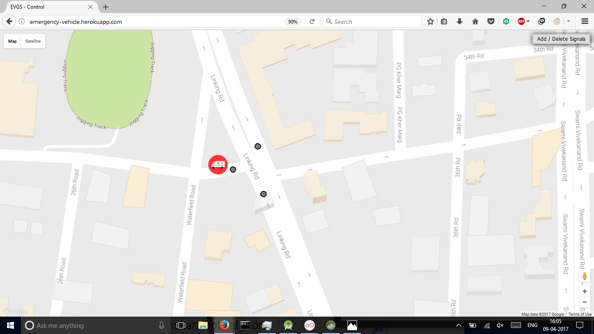

# Emergency-Vehicle-Guidance-System

An application built to help emergency vehicles get to their destination faster by tracking their position and preempting all traffic signals on their path

A video demonstration of the project can be found here: https://drive.google.com/open?id=0Bye-Zf9NW_rDYnNFVGFnWEwtNlU

Presentaition explaining the working of the systen can be found here: https://drive.google.com/open?id=10ATAXcOUyuYeKQIIQL8EvBtuiihmzHRfV8E7silNzEU

Technical paper for the same can be found here: https://drive.google.com/open?id=1l0Jcj7MrLk536pX4hee_mTCbRhcuLbVf

Server code for the project: https://github.com/pkotwal/Emergency-Vehicle-Guidance-System-Server

Link to website: http://emergency-vehicle.herokuapp.com/

## Key Features
### Android Application
- Registration, only few certified Emergency Vehicles are authorized, based on registration number
- Users search for destination and get directions directly within app
- User is notified if control center sets emergency point and that is the closest emergency vehicle, via push notification
- User can pick destination on map
- Users can view turn by turn navigation and view traffic signals crossed
- Location of device is constantly tracked while in use to determine which traffic signal must be preempted

### Control Center
- Can view all signals and their status within system
- Can set new emergency point and nearest vehicle is called to that point
- Can add, edit or remove traffic signals used in the system

## Screenshots

### Android App

Login / Registration Page: Simple Login Page, Authentication based on Registration number

Different Methods to pick destination

Pick destination from map:

Confirm Location:

Pick Destination via searchbox:

Destination set via emergency point (Push Notification received):

Getting Directions:

Direction Overview:

Navigating:

### Control Center

Vehicle Approaching Signal:

Vehicle Passed Signal:

View Signal Details:

Adding Signal:

Signal Added:

Setting Emergency Point:

## External Dependencies
- Socket.io
- Firebase Cloud Messaging

